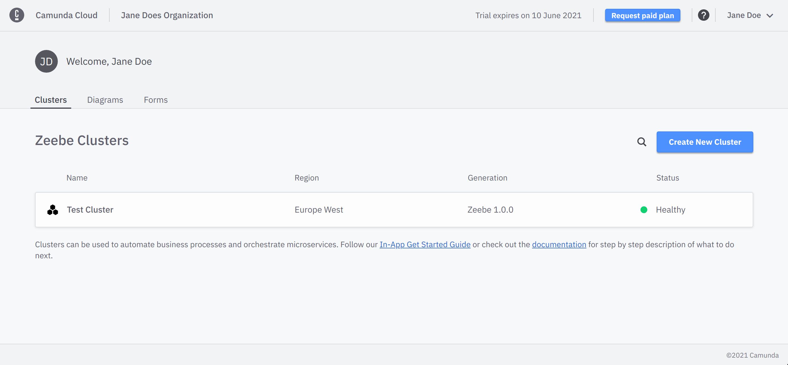
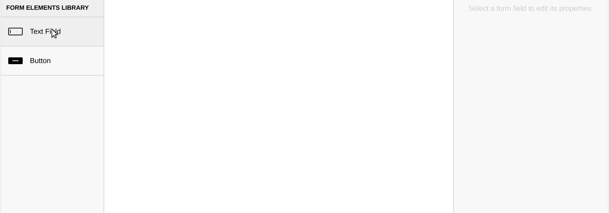
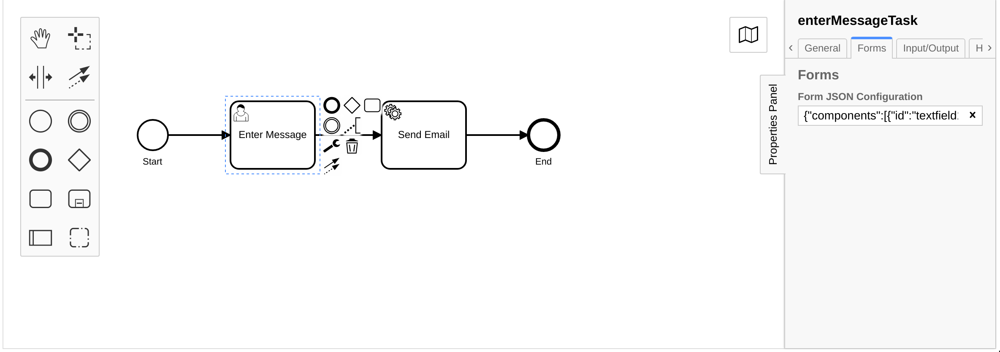
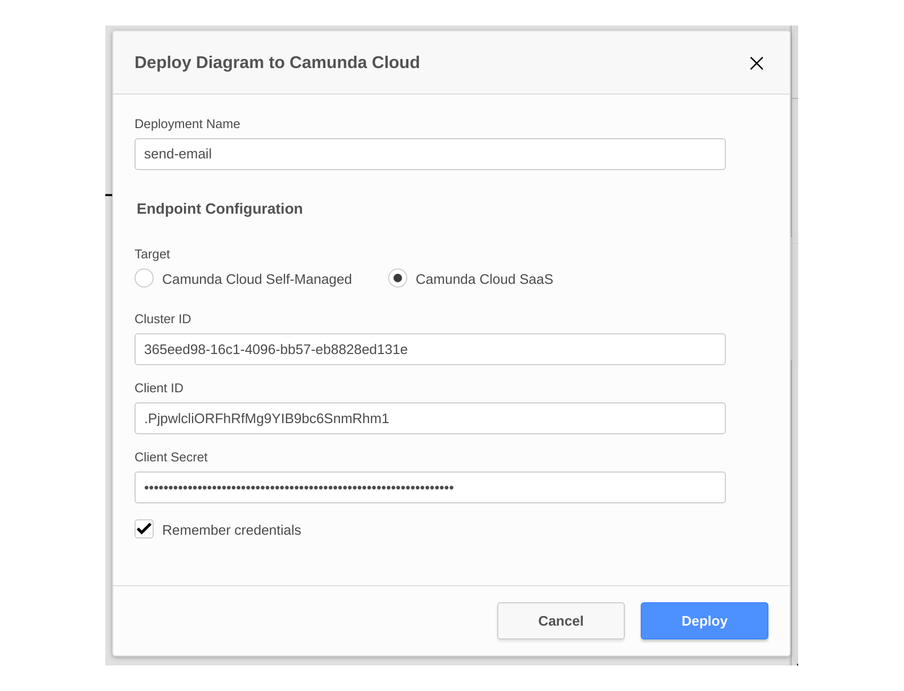
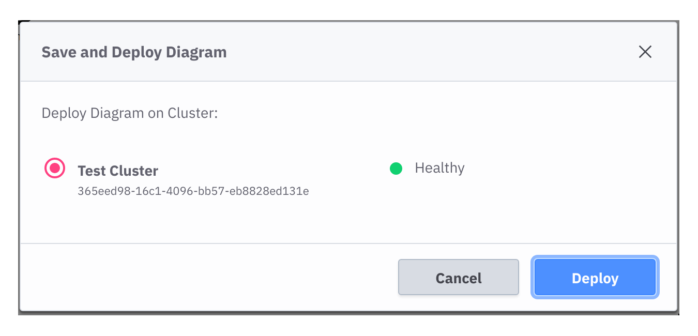
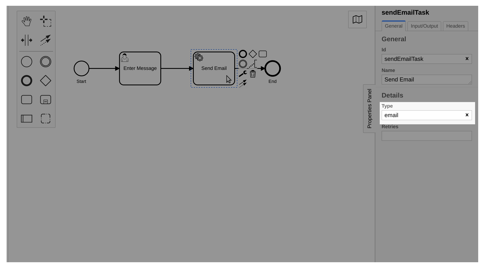

# Camunda Cloud - Get Started

This repository contains a short guide to get started with [Camunda
Cloud](https://camunda.com/products/cloud/). It contains instructions on how to
model your first process, create a user task form, and automate a service task.
During the guide you will use the Console, Modeler, Zeebe, Operate and Tasklist.

# Table of Contents

* [Repository structure](#repository-structure)
* [Setup the environment](#setup-the-environment)
* [Model the process](#model-the-process)
   * [Model the user task form](#model-the-user-task-form)
   * [Configure user task to use form](#configure-user-task-to-use-form)
   * [Configure service task](#configure-service-task)
* [Deploy Process](#deploy-process)
   * [Deploy using Camunda Modeler](#deploy-using-camunda-modeler)
   * [Deploy using Camunda Cloud](#deploy-using-camunda-cloud)
   * [Deploy using zbctl](#deploy-using-zbctl)
   * [Deploy using code](#deploy-using-code)
* [Start Process Instance](#start-process-instance)
   * [Start Instance using Camunda Modeler](#start-instance-using-camunda-modeler)
   * [Start Instance using Camunda Cloud](#start-instance-using-camunda-cloud)
   * [Start Instance using zbctl](#start-instance-using-zbctl)
   * [Start Instance using code](#start-instance-using-code)
* [Complete the User Task](#complete-the-user-task)
* [Complete the Service Task](#complete-the-service-task)
* [Further References](#further-references)
* [Local Setup](#local-setup)

# Repository structure

The repository contains the following folders:

- [_images_](images/) - contains screenshots and images for the guide
- [_java_](java/) - Plain Java example for deploy, create instance and a job worker
- [_nodejs_](nodejs/) - Node.js example for deploy, create instance and a job worker
- [_process_](process/) - contains the BPMN process and the User Task form
- [_spring_](spring/) - Spring Boot example for deploy, create instance and a job worker

# Setup the environment

To follow this guide we need a running Camunda Cloud cluster. For this purpose
we use the Camunda Cloud SaaS offering at https://camunda.io.

In case you prefer a local setup, please have a look at the [end of the guide](#local-setup).

After the sign-up and log-in at https://camunda.io, a cluster is already
available with the latest stable version of Zeebe with the name _Test Cluster_.



If there is no cluster available [create a new
one](https://docs.camunda.io/docs/product-manuals/cloud-console/manage-clusters/create-cluster)
with the latest stable version of Zeebe.

After the cluster is available, we need to create a pair of [_Client
Credentials_](https://docs.camunda.io/docs/product-manuals/cloud-console/manage-clusters/manage-api-clients).
To do this, enter the Clusters detail page, and switch to the _API_ tab. Create a
new client credential and either note down the client id and client secret, or
download the credentials file.


# Model the process

In this example, we want to model a simple process to send an email message.
Camunda Cloud allows you us the
[BPMN](https://docs.camunda.io/docs/reference/bpmn-workflows/bpmn-primer)
standard to model your business processes.  The process will consist of two
tasks: a user task to allow a human to enter the message content, and a service
task to automatically send the email message.


**Note**: To keep the scope of this guide easy to follow, we only build the
scaffolding for this process automation example, but we will not actually send
an email. This can be a task for you to extend the example and connect to a mail
provider.

To create the process we can use the desktop [Camunda Modeler] or the [Cloud
Modeler].


The finished process can be found at [process/send-email.bpmn](process/send-email.bpmn).

## Model the user task form

To help users to complete the user task _Enter Message_ we will create a user
task form using the modeler. Again the [Camunda Modeler] or the [Cloud Modeler]
can be used to create the form.



The finished form can be found at [process/enter-email-message.form](process/enter-email-message.form).

## Configure user task to use form

Now that we have created a form, we have to configure the user task to use the form.
To do this, we have to copy the JSON content of the form into the _Form Json
Configuration_ field under the _Forms_ tab of the modeler.



## Configure service task

The last step is to define the job type of the service task. The job type is
needed for a job worker to subscribe to the jobs of the task and
complete them. The [Camunda Cloud Documentation][Camunda Cloud Documentation] contains more information about
[job
workers](https://docs.camunda.io/docs/product-manuals/concepts/job-workers).


# Deploy Process

The process can be deployed using the [Camunda
Modeler](#deploy-using-camunda-modeler), [Cloud
Modeler](#deploy-using-camunda-cloud), [zbctl](#deploy-using-zbctl) or your [own
code](#deploy-using-code).

## Deploy using Camunda Modeler

To deploy the [process](process/send-email.bpmn) using the Camunda Modeler
follow these steps:

1. Press the _Deploy current diagram_ button
    
2. Configure the endpoint for the deployment. For Camunda Cloud
   you need the cluster id from the cluster details page, and the [client
   credentials](#-cloud) you created.
    

## Deploy using Cloud Modeler

To deploy the [process](process/send-email.bpmn) using the Cloud Modeler
follow these steps:

1. Press the _Deployment_ button and select _Save and Deploy_
    
2. Select the cluster to deploy the diagram on
    

## Deploy using zbctl

To the deploy the [process](process/send-email.bpmn) using `zbctl` use the
following command.

For **Camunda Cloud** we need the cluster id and the [client
credentials](#setup-the-environment)

```bash
zbctl deploy send-email.bpmn \
  --address 365eed98-16c1-4096-bb57-eb8828ed131e.zeebe.camunda.io:443 \
  --clientId 'GZVO3ALYy~qCcD3MYq~sf0GIszNzLE_z' \
  --clientSecret '.RPbZc6q0d6uzRbB4LW.B8lCpsxbBEpmBX0AHQGzINf3.KK9RkzZW1aDaZ-7WYNJ'
```

## Deploy using code

Writing your own code allows you to deploy the process, for example, on application
startup, to ensure that the latest version is deployed. To see examples of
this check out the programming language [specific folders](#repository-structure).

# Start Process Instance

You can start a new instance of the process using the [Camunda
Modeler](#start-instance-using-camunda-modeler), [Cloud
Modeler](#start-instance-using-camunda-cloud), [zbctl](#start-instance-using-zbctl) or [own
code](#start-instance-using-code).

## Start Instance using Camunda Modeler

To start an instance of the process with the Camunda Modeler: after the process is deployed, click the _Start Current Diagram_ button.


## Start Instance using Cloud Modeler

To start an instance of the process using the Cloud Modeler follow these steps:

1. Press the _Deployment_ button and select _Start Instance_ 
2. Specify **optional** [process
   variables](https://docs.camunda.io/docs/product-manuals/concepts/variables)
   before starting the instance 

## Start Instance using zbctl

To start a process instance of the BPMN process id `send-email` using the zbctl
use the following command.

For **Camunda Cloud** we need the cluster id and the [client
credentials](#setup-the-environment)

```bash
zbctl create instance send-email \
  --address 365eed98-16c1-4096-bb57-eb8828ed131e.zeebe.camunda.io:443 \
  --clientId 'GZVO3ALYy~qCcD3MYq~sf0GIszNzLE_z' \
  --clientSecret '.RPbZc6q0d6uzRbB4LW.B8lCpsxbBEpmBX0AHQGzINf3.KK9RkzZW1aDaZ-7WYNJ'
```

## Start Instance using code

Writing your own code allows you to start an instance of the process on an
external trigger, like an incoming message or a user request. To see examples of this
check out the programming language [specific folders](#repository-structure).

# Complete the User Task

The first task of the process is the [user
task](https://docs.camunda.io/docs/reference/bpmn-workflows/user-tasks/user-tasks)
_Enter Message_.


To complete the user task we can use Tasklist. To do this, visit the cluster's
details page in Camunda Cloud and launch Tasklist.

In Tasklist, select the _Enter Message_ task from the list of tasks.
Then click the _claim_ button to assign the task to you to work on it. Fill out
the `E-Mail Content` field with the message you want to send and click the
`Complete Task` button


# Complete the Service Task

The second task of the process is the [service
task](https://docs.camunda.io/docs/reference/bpmn-workflows/service-tasks/service-tasks)
_Send Email_.


To complete the service task we need to implement the business logic, therefore
we have to create a [job
worker](https://docs.camunda.io/docs/product-manuals/concepts/job-workers) for
the task type we defined in the diagram. The job worker will subscribe to all
jobs with the same task type.

To define the task type we can select the service task in the diagram and use
the properties panel to set the task type to `email`.



To implement the logic we have to implement a job worker. Check out the
programming language [specific folders](#repository-structure) to find the job
worker implementations.

# Further References

You can find more information in the [Camunda Cloud
Documentation][Camunda Cloud Documentation], or join the [Camunda Cloud
Forum](https://forum.camunda.io) and [Camunda Cloud
Slack](https://camunda-cloud.slack.com) Community.

## Local Setup

To run the getting started guide against a locally hosted instance you have to setup the following
components:

- [Zeebe](https://docs.camunda.io/docs/product-manuals/zeebe/deployment-guide/local/install)
- [Operate](https://docs.camunda.io/docs/product-manuals/operate/deployment/install-and-start)
- [Tasklist](https://docs.camunda.io/docs/product-manuals/tasklist/deployment/install-and-start)
- [Camunda Modeler]

If docker is available in your system, the `docker-compose.yaml` in the root
folder can be used to spin up a local environment.

```
docker-compose up -d
```

After this Zeebe is available under `localhost:26500`, please disable security
inside the client when connecting to it.

Operate will be available under http://localhost:8080 and Tasklist will be
available under http://localhost:8081.

[Camunda Modeler]: https://camunda.com/download/modeler/
[Cloud Modeler]: https://docs.camunda.io/docs/product-manuals/modeler/cloud-modeler/launch-cloud-modeler
[Camunda Cloud Documentation]: https://docs.camunda.io
